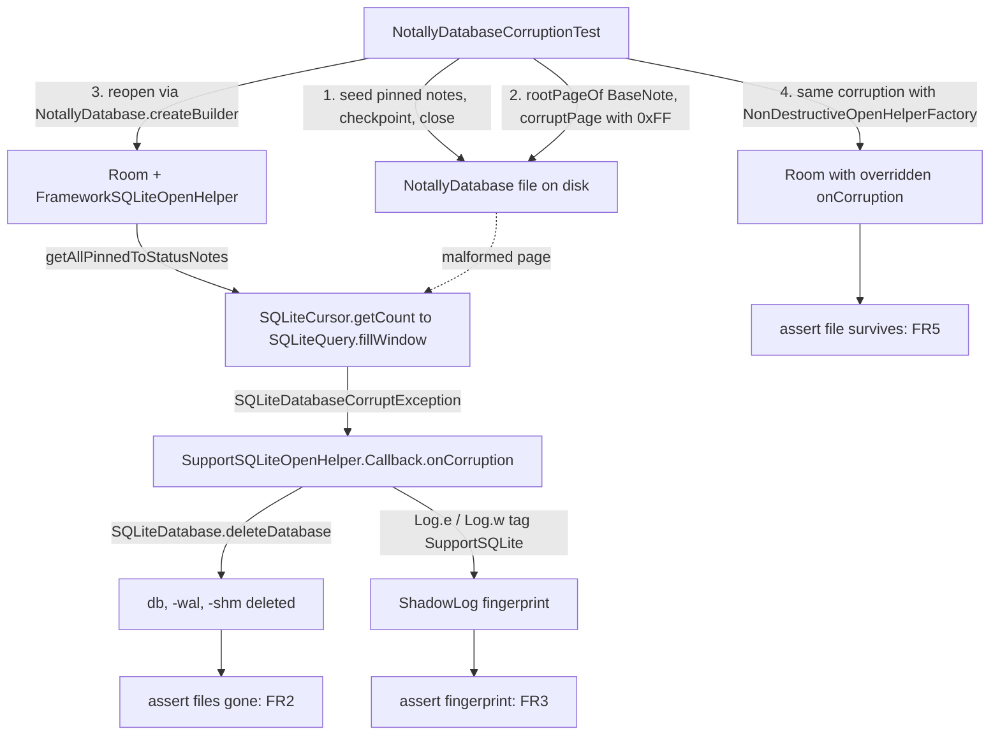

# Requirements

### Overview & Goals

Turn culprit #1 of the analysis from a code-reading argument into an **executable, repeatable proof**: an automated test showing that a single transient `SQLITE_CORRUPT` on **the app's own Room configuration** makes Android/Room delete `NotallyDatabase`, `NotallyDatabase-wal` and `NotallyDatabase-shm`, wiping every note, while attachments in the media directories survive untouched.

The test must also demonstrate the *counter-factual*: with a non-destructive `onCorruption` the same corruption leaves the file on disk. That pins the deletion on `SupportSQLiteOpenHelper.Callback.onCorruption` and pre-validates the planned P0 fix.

### Scope

**In scope**

- One new JVM test class under `app/src/test/kotlin`, run by the existing `testDebugUnitTest` / `testReleaseUnitTest` tasks with `RobolectricTestRunner` (same pattern as `NoteRepairUtilsDbTest` / `NoteSplitUtilsDbTest`).
- A minimal `@VisibleForTesting` seam in `NotallyDatabase` so the test builds the **real production** Room configuration instead of a hand-written copy.
- Test-only helpers that corrupt a real SQLite file on disk.
- Four scenarios: query-time corruption (matching the reported stack trace), open-time corruption, non-destructive-handler counter-proof, attachment survival.

**Out of scope**

- Implementing the fix itself (the P0/P1/P2 items in *Proposed Hardening* stay a separate follow-up).
- The SQLCipher / biometric-lock configuration: `NotallyDatabase.createInstance` calls `System.loadLibrary("sqlcipher")`, and the `net.zetetic` native library cannot load on the JVM, so the encrypted path cannot be covered by a Robolectric test. Its (non-deleting) behaviour stays a code-level claim.
- Culprits #2–#7 of the analysis.

### User Stories

- As a maintainer, I want a test that demonstrates one corrupt page destroys all notes, so the priority of the corruption handler is beyond dispute and can never silently regress.
- As a maintainer, I want proof that overriding `onCorruption` prevents the deletion, so I know the planned fix works before writing production code.
- As a maintainer, I want the test to reproduce the *reported* stack trace (`getAllPinnedToStatusNotes` → `SQLiteCursor.getCount` → `SQLiteQuery.fillWindow`), so it is recognisably the users' bug and not an artificial one.

### Functional Requirements

 ID | Requirement |
---|---|
 FR1 | A seeded, file-based `NotallyDatabase` built with the production configuration, whose `BaseNote` b-tree page is corrupted on disk, throws an `SQLiteException` from `getAllPinnedToStatusNotes()`. |
 FR2 | After FR1, `NotallyDatabase`, `NotallyDatabase-wal` and `NotallyDatabase-shm` no longer exist on disk — asserted explicitly, this is the data loss. |
 FR3 | The deletion is attributed to AndroidX: `ShadowLog` contains the tag `SupportSQLite` with `Corruption reported by sqlite on database:` and `deleting the database file:`. |
 FR4 | Corruption detected *before* the database is open (destroyed header magic) also deletes the file — the `db.isOpen == false` branch. **Measured behaviour, stronger than assumed:** AndroidX (`FrameworkSQLiteOpenHelper.innerGetDatabase`) deletes the file and then *retries the open*, so the app silently continues on a brand-new empty database and **no exception is raised at all** — exactly the reports with no preceding exception. |
 FR5 | With a test-local open-helper factory whose `onCorruption` does not delete, the same corruption still throws but the database file **still exists**, and the override is recorded as invoked. |
 FR6 | Attachment files placed in the app's media/attachment directories still exist after FR1 deleted the database — mirroring the user reports. |

### Non-Functional Requirements

- **No new dependencies.** `robolectric:4.16.1`, `androidx.test:core-ktx`, `junit`, `assertj` are already declared; `android-all-instrumented-15` is already in the local Maven cache, so the test runs offline with no emulator or device.
- **Deterministic.** No sleeps, no reliance on GC or timing; corruption is produced by writing known bytes at a computed file offset.
- **Self-cleaning.** Each test closes its Room instance and leaves no stray `NotallyDatabase*` files that could leak into other tests.
- Formatting must satisfy the repo's `ktfmt` pre-commit hook.

# Test Design

### Current Implementation

`NotallyDatabase.createInstance` (`app/src/main/java/com/philkes/notallyx/data/NotallyDatabase.kt:155-232`) builds the database and, on the plaintext path, never calls `openHelperFactory(...)`. Room therefore falls back to `FrameworkSQLiteOpenHelperFactory` and to the **default** `SupportSQLiteOpenHelper.Callback.onCorruption`.

Verified chain against the artifacts this project actually resolves (`room-runtime:2.6.1`, `sqlite-framework:2.4.0`, `sqlite:2.4.0`):

1. `android.database.sqlite.SQLiteQuery.fillWindow()` catches `SQLiteDatabaseCorruptException` and calls `onCorruption()` — confirmed in the bytecode of the `android-all-instrumented-15` jar Robolectric loads (`Exception table: … Class android/database/sqlite/SQLiteDatabaseCorruptException` → `invokevirtual onCorruption:()V`).
2. `FrameworkSQLiteOpenHelper` (line ~128) forwards it via `DatabaseErrorHandler { dbObj -> callback.onCorruption(…) }`.
3. Room's `RoomOpenHelper` does **not** override `onCorruption`.
4. `SupportSQLiteOpenHelper.Callback.onCorruption` (`sqlite:2.4.0`, lines 211-273) logs `Corruption reported by sqlite on database:` and `deleting the database file:` under tag `SupportSQLite`, then calls `SQLiteDatabase.deleteDatabase(File)` — removing the DB plus `-journal`, `-shm`, `-wal`, `*-mj*`.

Existing test conventions to follow: `app/src/test/kotlin/com/philkes/notallyx/utils/NoteRepairUtilsDbTest.kt` uses `@RunWith(RobolectricTestRunner::class)` + `@Config(manifest = Config.NONE, sdk = [35])` and `Room.inMemoryDatabaseBuilder(…).allowMainThreadQueries()`. Shared test helpers live in `app/src/test/kotlin/com/philkes/notallyx/test/TestUtils.kt`.

### Key Decisions

1. **Robolectric with `SQLiteMode.NATIVE`** (its default since 4.9, but asserted explicitly via `@SQLiteMode`). In NATIVE mode Robolectric runs the real AOSP `android.database.sqlite` classes over a real native SQLite, so `nativeExecuteForCursorWindow` → `SQLiteDatabaseCorruptException` → `onCorruption` → `SQLiteDatabase.deleteDatabase` all execute for real. Under `LEGACY` (sqlite4java) that path does not exist, so the annotation is a correctness guard rather than decoration.
2. **File-based, not in-memory.** The claim under test is that a *file* is deleted; `Room.inMemoryDatabaseBuilder` cannot express it, and `deleteDatabaseFile` explicitly no-ops for `:memory:`.
3. **A `@VisibleForTesting internal` builder seam in `NotallyDatabase`** instead of duplicating the builder in the test. `createInstance` is private and its SDK≥M branch calls `System.loadLibrary("sqlcipher")`, which cannot run on the JVM; extracting only the builder configuration keeps production behaviour identical while letting the test assert against the *real* configuration, so the test cannot silently drift from `createInstance`.
4. **Corrupt the `BaseNote` b-tree root page, looked up from `sqlite_master.rootpage`.** Page 1 (`sqlite_master`) and `room_master_table` stay readable, so Room opens and passes its identity check and the failure surfaces exactly where the users' stack trace shows it — inside `getAllPinnedToStatusNotes()`. Corrupting the file indiscriminately would fail during open and prove a weaker claim.
5. **Attribute the deletion twice.** The `ShadowLog` fingerprint (FR3) proves *who* deleted; the non-destructive-factory counter-proof (FR5) proves *that overriding it is sufficient*. Neither alone is conclusive.
6. **Do not use `mockAndroidLog()` from `TestUtils.kt`** in this class — it statically mocks `android.util.Log` with MockK and would swallow the fingerprint lines FR3 asserts on.

### Proposed Changes

**Production (test seam only, no behaviour change)** — `NotallyDatabase.kt`:

```kotlin
@VisibleForTesting
internal fun createBuilder(context: Context, databaseName: String): Builder<NotallyDatabase> =
    Room.databaseBuilder(context, NotallyDatabase::class.java, databaseName)
        .addMigrations(
            Migration2, Migration3, Migration4, Migration5, Migration6,
            Migration7, Migration8, Migration9, Migration10, Migration11,
        )
```

`createInstance` then begins with
`val instanceBuilder = createBuilder(context, getCurrentDatabaseName(context, dataInPublic))`;
everything else (the SQLCipher branch, the observers, `build()`) is untouched. Kotlin `internal` is already visible to the module's unit-test source set, so no public API is widened.

**Test helpers** — `app/src/test/kotlin/com/philkes/notallyx/test/SqliteCorruptionUtils.kt`:

```kotlin
/** Page size from the SQLite header (bytes 16..17, big-endian; the value 1 means 65536). */
fun File.readSqlitePageSize(): Int

/** Overwrites page [pageNumber] (1-based) with bytes that are not a valid b-tree page. */
fun File.corruptPage(pageNumber: Int, pageSize: Int = readSqlitePageSize())

/** Destroys the `SQLite format 3` magic so the file cannot be opened as a database at all. */
fun File.destroySqliteHeaderMagic()

/** `SELECT rootpage FROM sqlite_master WHERE name = ?` */
fun NotallyDatabase.rootPageOf(table: String): Int

/** Convenience over `<db>`, `<db>-wal`, `<db>-shm`. */
fun File.databaseFiles(): List<File>
```

`corruptPage` uses `RandomAccessFile(file, "rw")`, seeks `(pageNumber - 1) * pageSize` and writes `ByteArray(pageSize) { 0xFF.toByte() }`. `0xFF` is not one of SQLite's valid page types (2, 5, 10, 13), so the page is rejected as *malformed* as soon as the b-tree is walked.

**Test class** — `app/src/test/kotlin/com/philkes/notallyx/data/NotallyDatabaseCorruptionTest.kt`:

```kotlin
@RunWith(RobolectricTestRunner::class)
@Config(manifest = Config.NONE, sdk = [35])
@SQLiteMode(SQLiteMode.Mode.NATIVE)
class NotallyDatabaseCorruptionTest {

    private val dbFile get() = NotallyDatabase.getInternalDatabaseFile(context)

    /** Exactly the production configuration, optionally with a custom open-helper factory. */
    private fun openDatabase(factory: SupportSQLiteOpenHelper.Factory? = null): NotallyDatabase

    /** Inserts pinned notes, returns `rootPageOf("BaseNote")`, then checkpoints and closes. */
    private fun seedAndClose(noteCount: Int = 20): Int
}
```

**Counter-proof factory (test-only, mirrors the planned P0 fix)** — wraps `FrameworkSQLiteOpenHelperFactory` and replaces the callback:

```kotlin
class NonDestructiveOpenHelperFactory(
    private val delegate: SupportSQLiteOpenHelper.Factory = FrameworkSQLiteOpenHelperFactory(),
) : SupportSQLiteOpenHelper.Factory {

    val corruptionReported = AtomicBoolean(false)

    override fun create(configuration: SupportSQLiteOpenHelper.Configuration) =
        delegate.create(
            SupportSQLiteOpenHelper.Configuration.builder(configuration.context)
                .name(configuration.name)
                .noBackupDirectory(configuration.useNoBackupDirectory)
                .allowDataLossOnRecovery(configuration.allowDataLossOnRecovery)
                // delegates onCreate/onUpgrade/onDowngrade/onOpen/onConfigure to Room's callback,
                // but onCorruption only records the event — no deleteDatabase
                .callback(RecordingCallback(configuration.callback, corruptionReported))
                .build()
        )
}
```

### File Structure

```
app/src/main/java/com/philkes/notallyx/data/
  NotallyDatabase.kt                        (modified: extract createBuilder seam)

app/src/test/kotlin/com/philkes/notallyx/
  data/NotallyDatabaseCorruptionTest.kt     (new: the four scenarios)
  test/SqliteCorruptionUtils.kt             (new: page size / page corruption / header helpers)
  test/NonDestructiveOpenHelperFactory.kt   (new: counter-proof factory + recording callback)
```

### Architecture Diagram



### Risks

 Risk | Mitigation |
---|---|
 An all-`0xFF` page might not be reported as `SQLITE_CORRUPT` by the bundled SQLite build. | The helper sanity-checks its own recipe with `PRAGMA integrity_check` on a **copy** of the corrupted file; escalate the damage (invalid cell-pointer array, oversized cell offsets) until `integrity_check` reports `malformed`. |
 FR4: a destroyed magic yields `SQLITE_NOTADB`, which AOSP maps to `SQLiteDatabaseCorruptException` — the mapping must hold on the Robolectric SDK used. | If a plain `SQLiteException` is raised without corruption being reported, keep the magic intact and corrupt page 1 after byte 16 (the `sqlite_master` root) instead, which fails during Room's identity check while still routing through `onCorruption`. |
 Leftover `-wal`/`-shm` after `close()` would make the corrupted offset point into stale data. | Call the production `NotallyDatabase.checkpoint()` and `close()`, then assert `-wal`/`-shm` are gone *before* corrupting, so the test fails loudly instead of passing vacuously. |
 `@Config(manifest = Config.NONE)` means no resources, so `BaseNoteDao.insertSafe` (uses `ContextWrapper.log` and string resources) may fail. | Seed with the plain `dao.insert(…)`, as `NoteRepairUtilsDbTest` already does. |
 `externalMediaDirs` may be empty under Robolectric, breaking `getExternalMediaDirectory()` (FR6). | Try `getExternalMediaDirectory()`; on failure fall back to `getPrivateAttachmentsRoot()` — FR6 only needs the attachments to live outside the database directory. |
 Robolectric reuses the same temp data directory across methods, so a surviving `NotallyDatabase` could leak between tests. | Delete all `NotallyDatabase*` files and call `ShadowLog.clear()` in `@Before`; close the instance in `@After`. |
 The `@VisibleForTesting` seam touches production code. | The extraction is mechanical — same `Room.databaseBuilder` call, same migrations in the same order, same returned builder; verified by the existing test suite still passing. |

# Test Cases

### Validation Approach

Each scenario follows the same shape: seed a real database through the production configuration, damage the file on disk, reopen through the production configuration, then assert both the raised exception **and** the resulting state of the files. The `-wal`/`-shm` absence is asserted *before* corrupting, so no test can pass vacuously.

### Key Scenarios

**TC1 — `queryOnCorruptBaseNotePage_deletesEntireDatabase`** (FR1, FR2, FR3)

1. Seed 20 notes with `isPinnedToStatus = true` through `NotallyDatabase.createBuilder`; record `rootPageOf("BaseNote")`; `checkpoint()`; `close()`.
2. Assert `NotallyDatabase` exists and is non-empty, and that `-wal`/`-shm` are gone.
3. `dbFile.corruptPage(rootPage)`.
4. Reopen with the production configuration; expect `SQLiteException` from `runBlocking { dao.getAllPinnedToStatusNotes() }`.
5. Assert `NotallyDatabase`, `-wal` and `-shm` all no longer exist — **this is the wipe**.
6. Assert `ShadowLog.getLogs()` contains tag `SupportSQLite` with `Corruption reported by sqlite on database:` and `deleting the database file:`.

**TC2 — `openOnCorruptHeader_deletesDatabaseAndSilentlyRecreatesItEmpty`** (FR4)

Seed and close as in TC1, call `destroySqliteHeaderMagic()`, then reopen and touch the database (`ping()`). Measured outcome: `SQLiteDatabase.open` raises `SQLITE_NOTADB`, `onCorruption` deletes the file, and AndroidX then **retries the open successfully** — so `ping()` returns `true`, no exception surfaces, and the 20 seeded notes are simply gone (`count() == 0`). The test therefore asserts the log fingerprint plus the empty database rather than an exception; this exercises the `db.isOpen == false` branch of `onCorruption` and is the closest match to the reports where no stack trace is ever seen.

**TC3 — `corruptPageWithNonDestructiveHandler_keepsDatabaseFile`** (FR5)

Identical corruption to TC1, but Room is built with `NonDestructiveOpenHelperFactory`. Expect the `SQLiteException` to still be thrown, `corruptionReported` to be `true`, and `NotallyDatabase` to **still exist** with its original length. This is the counter-proof that the deletion comes from the default callback and that overriding it is sufficient.

**TC4 — `databaseWipe_leavesAttachmentsUntouched`** (FR6)

Before corrupting, create dummy files under `Images/`, `Files/` and `Audios/` (`SUBFOLDER_IMAGES` / `SUBFOLDER_FILES` / `SUBFOLDER_AUDIOS` from `IOExtensions.kt`) in the attachments root. Run the TC1 corruption, then assert the database is gone while every attachment file still exists with unchanged content — reproducing the exact shape of the user reports.

### Edge Cases

- `-wal`/`-shm` still present after `close()` → the pre-condition assertion in TC1 step 2 fails, so the suite cannot pass without really corrupting live data.
- Corruption not detected (the query returns rows) → `assertThrows` fails, signalling that the corruption recipe, not the app, needs adjusting.
- Room recreating an empty database after the deletion → assert on file existence **immediately** after the exception, before any further DAO call.
- `getAllPinnedToStatusNotes()` returning an empty list instead of throwing → treated as a failure; the seed inserts pinned notes precisely so the query must walk the corrupted b-tree.

### Test Changes

- Added: `NotallyDatabaseCorruptionTest` (four tests), `SqliteCorruptionUtils`, `NonDestructiveOpenHelperFactory`.
- Unchanged: every existing test. The `createBuilder` extraction is behaviour-preserving, and `NoteRepairUtilsDbTest` / `NoteSplitUtilsDbTest` keep using `Room.inMemoryDatabaseBuilder`.
- Explicitly not covered, documented in the test's KDoc: the SQLCipher / biometric-lock configuration, which cannot be exercised on the JVM.

# Findings

### Task

Analysis only — **no code was added or changed**. Goal: identify the most likely causes of users' `NotallyDatabase` being completely wiped while attachments in the media folders survived, and of the reported `SQLiteDatabaseCorruptException: database disk image is malformed`.

### The wipe mechanism (very high confidence)

The deletion is performed by Room/Android, not by app code.

`NotallyDatabase.kt:161-232` builds the database without any `DatabaseErrorHandler` and without overriding `onCorruption`:

```kotlin
Room.databaseBuilder(context, NotallyDatabase::class.java, getCurrentDatabaseName(...))
    .addMigrations(Migration2, ... Migration11)
    // plaintext case → default FrameworkSQLiteOpenHelperFactory
```

Verified chain against the artifacts this project actually resolves (`room-runtime:2.6.1`, `sqlite-framework:2.4.0`, `sqlite:2.4.0`):

1. `android.database.sqlite.SQLiteQuery.fillWindow()` catches `SQLiteDatabaseCorruptException` and calls `onCorruption()`.
2. `FrameworkSQLiteOpenHelper` (line ~128) forwards it to `callback.onCorruption(db)`.
3. Room's `RoomOpenHelper` does **not** override `onCorruption` (no occurrence in room-runtime 2.6.1 sources).
4. The inherited `SupportSQLiteOpenHelper.Callback.onCorruption()` logs `"Corruption reported by sqlite on database: …"`, then `"deleting the database file: …"`, then calls `SQLiteDatabase.deleteDatabase(File)` — which removes `NotallyDatabase`, `-wal`, `-shm`, `-journal` and `*-mj*`.

The reported stack trace is exactly this path (`SQLiteCursor.getCount → fillWindow → SQLiteQuery.fillWindow`), triggered by `getAllPinnedToStatusNotes`, which runs at every cold start from `NotallyXApplication.restorePinnedNotifications()` (`NotallyXApplication.kt:165-177`) in an un-guarded `Dispatchers.IO` coroutine. The DB is deleted *before* the exception surfaces, and the exception may be swallowed — matching "there is not always an exception directly before".

**Asymmetry worth checking against the reports:** only the plaintext path deletes. With biometric lock the SQLCipher helper is used and `net.zetetic.database.DefaultDatabaseErrorHandler.onCorruption()` returns early (`if (SQLiteDatabase.hasCodec()) return;`) without deleting.

### Ranked culprits

 # | Culprit | Confidence |
---|---|---|
 1 | Room's default `onCorruption` **deletes** the DB + `-wal`/`-shm`; any transient corruption becomes total, silent loss | Very high |
 2 | SharedPreferences excluded from backup while the DB domain is included ⇒ `dataInPublicFolder` resets to `false` ⇒ app opens/creates an **empty internal DB** while the real one sits in `Android/media/...` ("wipe" with no exception) | High |
 3 | Non-atomic `copyTo(overwrite = true)` over the live DB file + stale `-wal`/`-shm` never deleted (biometric-lock enable/disable, public-folder switch) | High |
 4 | Broken DB singleton / leaked never-closed instances, plus platform SQLite and bundled SQLCipher SQLite concurrently on the same WAL file | High |
 5 | Android Auto Backup of a live WAL database ⇒ inconsistent restore ⇒ corruption ⇒ #1 | Medium-high |
 6 | `ErrorActivity` (`:error_activity` process) calling `deleteDatabase()` before a reimport that can fail | Medium |
 7 | DB stored in `Android/media/...` (FUSE/SD-card locking, deletion by cleaner apps/MediaStore) | Medium |

### Evidence per culprit

**#2 — wrong file, not a wipe.** `res/xml/backup_content.xml` and `res/xml/data_rules.xml` exclude only `domain="sharedpref"`, so the `database` domain is backed up and restored while prefs are not. `dataInPublicFolder` (`NotallyXPreferences.kt:206`, default `false`), `dataSchemaId` (`:238`), `iv`, `databaseEncryptionKey` and `biometricLock` are all preferences. After a cloud restore / device transfer / prefs loss:
- public-folder users get `dataInPublicFolder = false` ⇒ `getCurrentDatabaseName()` returns the internal name ⇒ Room creates a fresh empty DB; the real data is still on disk and recoverable;
- `dataSchemaId` resets ⇒ `runMigrations()` re-runs attachment moves and note splitting;
- biometric-lock users get an encrypted DB with no Keystore key and `preferences.iv.value!!` (`NotallyDatabase.kt:239`) ⇒ NPE / permanently unopenable DB.

**#3 — non-atomic overwrite.** `BaseNoteModel.kt:326-375` (`enableBiometricLock`/`disableBiometricLock`) does `dbFileCopy.copyToLarge(originalDbFile, overwrite = true)`; Kotlin's `copyTo(overwrite = true)` deletes the target first and streams without `fsync`, so interruption leaves a truncated/0-byte DB. The old `-wal`/`-shm` are never removed, so the next open recovers a WAL that belongs to a different database. `SQLCipherUtils.java:190-278` has the same defect (`originalFile.delete(); newFile.renameTo(originalFile);`, return value unchecked, `-wal`/`-shm` ignored) and its own javadoc forbids running it while the DB is open. `enableDataInPublic`/`disableDataInPublic` (`BaseNoteModel.kt:262-324`) copy `db`, `-wal`, `-shm` one-by-one with the DB still open (only `checkpoint()`, never `close()`).

**#4 — multiple connections / two SQLite libraries.** `NotallyDatabase.getDatabase()` (`:104-115`) is a double-checked lock with **no re-check inside `synchronized`**, so concurrent callers each build a `RoomDatabase` and the loser is leaked open. The `biometricLock` / `dataInPublicFolder` observers (`:200-228`) `postValue(newInstance)` without closing the old one; `getFreshDatabase()` adds more. Meanwhile `SQLCipherUtils.getDatabaseState()` (called from `:183`/`:192` on every `createInstance`) and `copyDatabase()` (`ExportExtensions.kt:565-586`, invoked on **every note save** when backup-on-save is on) open the *live* file with the bundled `net.zetetic` SQLite — including `OPEN_READWRITE` + `ATTACH` + `sqlcipher_export`. The `-shm` wal-index format is implementation-specific; concurrent WAL access from two SQLite builds is unsupported. A leaked connection closing after the file body was swapped checkpoints stale pages into the new file.

**#6 — second process.** `AndroidManifest.xml:151` puts `ErrorActivity` in `:error_activity`; `ErrorActivity.kt:200-223` runs `copyDatabase()` → `deleteDatabase(DATABASE_NAME)` → `clearInstance()` → `importRawDatabase(uri, …)`. A truncated export, a failing import, or a public-folder user (where `deleteDatabase` only touches the internal path) ends with an empty DB — and this path is offered exactly to users who already crashed.

### Secondary data-loss issues (not full wipes)

- `copyDatabase()` copies only the main DB file and **discards the result of `pragma wal_checkpoint(FULL)`**; a busy checkpoint (likely given #4) means backups can silently lack the newest notes.
- `DataSchemaMigrations.kt:95-99` deletes notes (`dao.delete(id)`) that cannot be read/repaired.
- `Migration3/4/5/7` use backticks for string defaults and `Migration6` uses `DEFAULT 'timestamp'` on an `INTEGER NOT NULL` column (`NotallyDatabase.kt:259-292`).
- `SQLCipherUtils.getDatabaseState()` returns `ENCRYPTED` for *any* open failure (`SQLCipherUtils.java:76-77`), so a merely damaged plaintext DB is misclassified and the app flips `biometricLock` to `ENABLED`.
- `SELECT * FROM BaseNote` with bodies up to `MAX_BODY_SIZE_MB = 1.5` (`BaseNoteDao.kt:38`, `:119-130`) stresses the 2 MB `CursorWindow` on exactly the crashing query.
- `Runtime.getRuntime().exit(0)` (`UiExtensions.kt:1027`, `SettingsFragment.kt:305`) hard-kills the process and can race with the copies in #3.

### How to confirm from existing reports

- Search user logs for `Corruption reported by sqlite on database:` and `deleting the database file:` — the fingerprint of #1.
- Correlate affected users with: biometric lock on/off (#1 only bites when off), "data in public folder" on/off (#2/#7), recent device restore/new phone/reinstall (#2/#5), recent lock toggle (#3).
- Ask whether `Android/media/com.philkes.notallyx/NotallyDatabase` still exists (⇒ #2, data recoverable) and whether `-wal`/`-shm` survived while the main file vanished (handler deletion vs. truncated copy).

# Proposed Hardening

### Status

Nothing here has been implemented. This tab records the fixes implied by the findings so they can be approved (or rejected) as follow-up work. The current task only *validates* culprit #1 with a test — the P0 handler below is the fix that test is designed to justify and, via TC3, to pre-validate.

### P0 — stop turning corruption into data loss

- Install a non-destructive corruption handler for both the plaintext and the SQLCipher path in `NotallyDatabase.createInstance` (custom `SupportSQLiteOpenHelper.Factory` wrapping `FrameworkSQLiteOpenHelperFactory`, or an `openHelperFactory` that supplies a `DatabaseErrorHandler`). On corruption: **rename** `NotallyDatabase*` to `NotallyDatabase-corrupt-<timestamp>`, log it, notify the user, and offer restore from the newest ZIP backup — never delete.
- Guard `NotallyXApplication.restorePinnedNotifications()` so a DB read failure at startup cannot escape unhandled.

### P0 — stop losing users' storage-location preference

- Exclude the `database` domain (and the DB path in the media dir) from `res/xml/backup_content.xml` and `res/xml/data_rules.xml`, or include the SharedPreferences so DB and prefs are always restored as a consistent pair.
- On startup, if the internal DB is missing/empty but a DB exists in the external media folder (or vice-versa), detect it and offer recovery instead of silently creating an empty database.

### P1 — make every DB file replacement atomic

- Single helper used by `enableBiometricLock`, `disableBiometricLock`, `enableDataInPublic`, `disableDataInPublic`: `close()` the Room instance → write to `<name>.tmp` → `fsync` → delete `-wal`/`-shm` of the target → `rename` into place → reopen and `ping()`; roll back from the retained original on any failure.
- Apply the same `-wal`/`-shm` handling inside `SQLCipherUtils.encrypt`/`decrypt` and check the `renameTo` result.

### P1 — one connection, one SQLite implementation

- Fix the double-checked locking in `NotallyDatabase.getDatabase()` and close the previous instance in the `biometricLock`/`dataInPublicFolder` observers and in `getFreshDatabase`.
- Cache the encrypted/plaintext state instead of probing the live file with `SQLCipherUtils.getDatabaseState()` on every `createInstance`; never open the live file with the zetetic library while Room holds it.
- Distinguish "unopenable" from "encrypted" in `getDatabaseState` so a damaged plaintext DB is no longer treated as encrypted.

### P2 — recovery paths and backup fidelity

- Remove `deleteDatabase()` from `ErrorActivity`'s reimport flow; import into a temp DB, verify, then swap atomically.
- Check the return value of `wal_checkpoint(FULL)` in `copyDatabase()` and either retry or include `-wal` in the copy, so backups cannot silently miss recent notes.
- Reconsider `dao.delete(id)` in `splitOversizedNotes()` — quarantine instead of delete.

# Delivery Steps

### ✓ Step 1: Extract a test seam for the production Room configuration
`NotallyDatabase` exposes the exact builder used in production, and every existing test still passes.

- Add `@VisibleForTesting internal fun createBuilder(context: Context, databaseName: String): Builder<NotallyDatabase>` to `NotallyDatabase`'s companion, containing the `Room.databaseBuilder(...)` call plus `addMigrations(Migration2 … Migration11)`.
- Change `createInstance` to obtain `instanceBuilder` from `createBuilder(context, getCurrentDatabaseName(context, dataInPublic))`, leaving the SQLCipher branch, the `biometricLock` / `dataInPublicFolder` observers and `build()` untouched.
- Confirm the change is behaviour-preserving by running the existing unit tests (`NoteRepairUtilsDbTest`, `NoteSplitUtilsDbTest`, `ConvertersTest`, the importer tests).

### ✓ Step 2: Add SQLite file-corruption test helpers
A test can damage a real SQLite file in a controlled, verifiable way.

- Create `app/src/test/kotlin/com/philkes/notallyx/test/SqliteCorruptionUtils.kt` with `File.readSqlitePageSize()` (header bytes 16..17, big-endian, `1` meaning 65536), `File.corruptPage(pageNumber, pageSize)` (`RandomAccessFile` seek to `(pageNumber - 1) * pageSize`, write `0xFF` bytes) and `File.destroySqliteHeaderMagic()`.
- Add `NotallyDatabase.rootPageOf(table: String): Int` backed by `SELECT rootpage FROM sqlite_master WHERE name = ?`, so the `BaseNote` b-tree can be targeted precisely while `sqlite_master` and `room_master_table` stay intact.
- Add a self-check that runs `PRAGMA integrity_check` against a **copy** of the corrupted file, so the helper fails fast if the recipe does not actually produce a malformed image on the bundled SQLite build.
- Add `File.databaseFiles()` returning `<db>`, `<db>-wal`, `<db>-shm` for the existence assertions.

### ✓ Step 3: Prove the wipe with query-time and open-time corruption tests
`NotallyDatabaseCorruptionTest` demonstrates that one corrupt page silently deletes every note while attachments survive.

- Create `app/src/test/kotlin/com/philkes/notallyx/data/NotallyDatabaseCorruptionTest.kt` annotated with `@RunWith(RobolectricTestRunner::class)`, `@Config(manifest = Config.NONE, sdk = [35])` and `@SQLiteMode(SQLiteMode.Mode.NATIVE)`, plus `@Before`/`@After` that clear `ShadowLog`, delete stray `NotallyDatabase*` files and close the instance.
- Add the private helpers `openDatabase(factory)` (delegating to `NotallyDatabase.createBuilder` with `allowMainThreadQueries()`) and `seedAndClose(noteCount)` (inserts pinned notes via `dao.insert`, records `rootPageOf("BaseNote")`, calls `checkpoint()` and `close()`, and asserts `-wal`/`-shm` are gone).
- Implement **TC1** `queryOnCorruptBaseNotePage_deletesEntireDatabase`: corrupt the `BaseNote` root page, expect `SQLiteException` from `getAllPinnedToStatusNotes()`, then assert the database plus `-wal`/`-shm` no longer exist and that `ShadowLog` contains the `SupportSQLite` lines `Corruption reported by sqlite on database:` and `deleting the database file:`.
- Implement **TC2** `openOnCorruptHeader_deletesDatabaseAndSilentlyRecreatesItEmpty`: destroy the header magic instead, then assert the same fingerprint via the `db.isOpen == false` branch of `onCorruption`. Measured: AndroidX deletes the file and retries the open, so `ping()` succeeds without any exception and the seeded notes are gone (`count() == 0`) — assert that silent recreation instead of an exception.
- Implement **TC4** `databaseWipe_leavesAttachmentsUntouched`: seed dummy files in the `Images`/`Files`/`Audios` subfolders of the attachments root before running the TC1 corruption, then assert they are all still present and unchanged after the database is gone.

### ✓ Step 4: Add the non-destructive-handler counter-proof
The suite shows that overriding `onCorruption` is by itself enough to stop the data loss.

- Create `app/src/test/kotlin/com/philkes/notallyx/test/NonDestructiveOpenHelperFactory.kt`: a `SupportSQLiteOpenHelper.Factory` wrapping `FrameworkSQLiteOpenHelperFactory` that rebuilds the `Configuration` with a callback delegating `onCreate`/`onUpgrade`/`onDowngrade`/`onOpen`/`onConfigure` to Room's callback while `onCorruption` only flips an `AtomicBoolean`.
- Implement **TC3** `corruptPageWithNonDestructiveHandler_keepsDatabaseFile`: reuse the TC1 corruption but open through that factory, assert the `SQLiteException` is still thrown, `corruptionReported` is `true`, and the database file still exists with its original length.
- Document in the class KDoc which culprit this test class validates, and that the SQLCipher configuration is deliberately not covered because `System.loadLibrary("sqlcipher")` cannot run on the JVM.
- Run `ktfmt` (via the pre-commit hook or the format task) and the full unit-test suite to confirm the new tests pass and nothing else regressed.