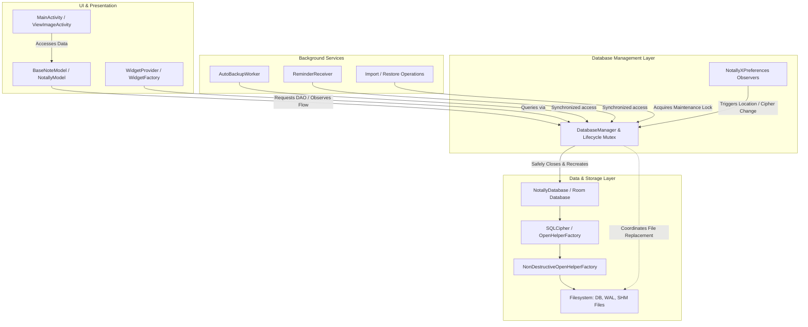

# Requirements

### Overview & Goals
The goal of this plan is to analyze the creation, migration, and interaction lifecycle of `NotallyDatabase` (Room database with SQLCipher encryption and dynamic storage location support) in NotallyX. We identify specific vulnerabilities that can cause dangling connections, file corruption, race conditions, or unhandled exceptions, and propose concrete architectural and code-level fixes.

### Scope
- **In Scope:**
  - Creation & Lifecycle: Singleton management, SQLCipher integration, unencrypted vs encrypted database initialization, dynamic switching between private internal storage and public shared storage.
  - Migrations: Room schema migrations (`Migration2`–`Migration11`), application data migrations (`DataSchemaMigrations`), and dynamic encryption/location migration routines.
  - Database Interactions: DAOs (`BaseNoteDao`, `CommonDao`, `LabelDao`), ViewModels (`BaseNoteModel`, `NotallyModel`), Background Workers (`AutoBackupWorker`, `AutoRemoveDeletedNotesWorker`, `CleanupMissingAttachmentsWorker`), Widgets (`WidgetProvider`, `WidgetFactory`), and Backup/Restore utilities (`ExportExtensions`, `ImportExtensions`).
  - Corruption Recovery: `NonDestructiveOpenHelperFactory` and crash/corruption backup mechanisms.
- **Out of Scope:**
  - UI visual layout redesigns not related to database state changes.
  - Unrelated third-party library updates.

### User Stories
- **As a user**, I want my notes and attachments to remain safe and intact when enabling or disabling biometric encryption, so that no database corruption occurs.
- **As a user**, I want to switch between internal private storage and public folder storage seamlessly without the app crashing on closed database connections or losing recent note edits.
- **As a user**, I want backup, restore, and import operations to safely synchronize write-ahead logs (WAL) so that all restored data is immediately available and valid.

### Functional Requirements
- **FR-1:** All database access must go through a thread-safe, coordinated lifecycle manager that guarantees singleton consistency.
- **FR-2:** Changing preferences (biometric lock, data location) must safely drain active transactions and close previous database connections before creating and posting the new instance.
- **FR-3:** Corruption recovery callbacks must never attempt to execute queries on a corrupted database instance.
- **FR-4:** All Room schema migrations must use standard SQLite syntax and handle large datasets without cursor buffer overflows.

### Non-Functional Requirements
- **Data Integrity:** Zero data loss during WAL checkpoints, backup export/import, and file replacement.
- **Thread Safety:** No uncoordinated concurrent access to the same SQLite database files across Room instances, Workers, and Receivers.
- **Performance:** Fast migration and smooth UI transitions without main-thread database blocking.

# Technical Design

### Current Implementation Analysis

1. **Database Creation & Singleton Lifecycle (`NotallyDatabase.kt`)**:
   - `NotallyDatabase` uses Room with an optional `SupportOpenHelperFactory` (SQLCipher) when biometric lock is active, wrapped in a `NonDestructiveOpenHelperFactory`.
   - Instance is stored as a `NotNullLiveData<NotallyDatabase>?` companion property.
   - When preferences (`biometricLock` or `dataInPublicFolder`) change, observers in `createInstance()` invoke `closeInstance()`, create a new instance, post the value, and re-subscribe observers.
   - `getFreshDatabase()` creates unmanaged `NotallyDatabase` instances directly accessing the same physical SQLite file while the singleton is still alive.

2. **Database Migrations (`NotallyDatabase.kt` & `DataSchemaMigrations.kt`)**:
   - Room migrations `Migration2` through `Migration11` handle schema updates (e.g. adding columns `color`, `images`, `audios`, `files`, `reminders`, `viewMode`, `isPinnedToStatus`, `order`).
   - `DataSchemaMigrations.kt` runs higher-level migrations based on `dataSchemaId` (e.g., attachment migration and note splitting for oversized text > 1.5MB to prevent `SQLiteBlobTooBigException`).
   - Dynamic location/encryption migrations in `BaseNoteModel` copy database files using `replaceDatabaseFile()`.

3. **Database Interactions & Observers**:
   - `BaseNoteModel.init()` caches DAO instances and registers `observeForever` listeners on `LiveData` queries.
   - Background tasks (`AutoBackupWorker`, `AutoRemoveDeletedNotesWorker`, `CleanupMissingAttachmentsWorker`) and `ReminderReceiver` access `NotallyDatabase.getDatabase(context)` asynchronously.
   - Backup and restore functions in `ExportExtensions` and `ImportExtensions` execute WAL checkpoints (`pragma wal_checkpoint(FULL)`) and replace database files on disk.

---

### Key Issues & Vulnerabilities Identified

#### 1. Singleton Initialization State Bug (`observePreferences = false`)
- **Location:** `NotallyDatabase.getDatabase(context, observePreferences)` & `NotallyXApplication.restorePinnedNotifications()`
- **Issue:** If `getDatabase(context, false)` is called first (which happens in `NotallyXApplication.restorePinnedNotifications` at app startup), the singleton `instance` is created with `observePreferences = false`. Subsequent calls that expect preference changes to trigger database recreation will receive this unobserved instance. Preference changes (such as enabling encryption or changing storage folder) will fail to reload the database.
- **Fix:** Remove the caller-controlled `observePreferences` flag from singleton retrieval; ensure preference observation and lifecycle management are encapsulated in a single manager.

#### 2. Dangling Observers and Stale DAOs on Database Re-creation
- **Location:** `BaseNoteModel.init(database)` & `NotallyDatabase.closeInstance()`
- **Issue:** When the database is recreated (e.g., toggling biometric lock or storage location), `closeInstance()` closes the previous `RoomDatabase`. However, `BaseNoteModel` and its active `LiveData` objects (`allNotes`, `deletedNotes`, `archivedNotes`, `reminderNotes`, `searchResults`) still retain references to DAOs from the closed database. Any pending observer notification or background query hits the closed database, throwing `IllegalStateException: Cannot access database on closed database` or leaking cursor windows.
- **Fix:** Refactor `BaseNoteModel` to observe database instances via a reactive stream (e.g. `Flow.flatMapLatest`) or systematically unregister old observers before replacing DAOs.

#### 3. Concurrent Multi-Instance File Access and WAL Locking Conflicts
- **Location:** `NotallyDatabase.getFreshDatabase()`, `BaseNoteModel.moveToPublicFolder()`, `BaseNoteModel.moveToPrivateFolder()`
- **Issue:** `getFreshDatabase()` instantiates an independent `RoomDatabase` instance pointing to the same SQLite database file while the primary `instance` is still open. Multiple open Room instances reading/writing to the same SQLite WAL file without coordinated connection pooling can cause `-shm` (shared memory) index corruption or `SQLiteDatabaseLockedException`.
- **Fix:** Avoid creating duplicate standalone `RoomDatabase` instances on the same file path. Perform maintenance tasks (ping, integrity check, migration) through a single controlled connection or close the existing instance before opening a replacement.

#### 4. Uncoordinated Database File Replacement and Active Connections
- **Location:** `IOExtensions.replaceDatabaseFile()`, `ExportExtensions.copyDatabase()`, `ImportExtensions.importZip()`
- **Issue:** `replaceDatabaseFile()` deletes companion files (`-wal`, `-shm`, `-journal`) and moves files on disk. If background tasks (`AutoBackupWorker`, `ReminderReceiver`, `WidgetProvider`) or UI queries execute concurrently, open file descriptors hold locks or write to deleted inodes, causing SQLite corruption.
- **Fix:** Introduce an application-wide database maintenance `Mutex` / lock that pauses/suspends all background and UI database operations during `replaceDatabaseFile()`.

#### 5. Recursive Corruption Risk in `NonDestructiveOpenHelperFactory`
- **Location:** `NonDestructiveOpenHelperFactory.RecordingCallback.onCorruption()`
- **Issue:** `onCorruption()` attempts to call `app.copyDatabase()`, which internally calls `NotallyDatabase.getDatabase().value.checkpointOrThrow()`. Querying or checkpointing an already-corrupted database instance during corruption recovery triggers secondary exceptions.
- **Fix:** In `onCorruption()`, do not invoke Room queries or checkpoints. Directly copy the raw on-disk files (`.db`, `-wal`, `-shm`) to the corrupted backup directory.

#### 6. SQLite Migration Syntax and Performance Hazards
- **Location:** `NotallyDatabase.Migration3`, `Migration4`, `Migration5`, `Migration7`, `Migration8`, `Migration11`
- **Issue:**
  - `Migration3` uses backticks for string literal defaults: ``DEFAULT `[]` `` instead of standard SQL single quotes `'[]'`. SQLite can interpret backticks as column/identifier names under certain compatibility modes.
  - `Migration8` and `Migration11` query cursors and execute individual `UPDATE` statements row-by-row in a Kotlin `while (cursor.moveToNext())` loop, which is slow and memory-intensive on large datasets.
- **Fix:** Use standard `'[]'` string literals and optimize cursor migrations with batch SQL statements.

---

### Architecture & Component Interaction

### Proposed Changes Summary
1. **Centralize Database Lifecycle**: Create a robust `DatabaseManager` to encapsulate singleton creation, preference observers, WAL checkpointing, and safe closing.
2. **Maintenance Synchronization Lock**: Protect file-level operations (`replaceDatabaseFile`, `copyDatabase`, encryption toggles) with a global mutex to prevent concurrent worker/UI read/write collisions.
3. **Safe Corruption Handler**: Remove Room/DAO interactions from `NonDestructiveOpenHelperFactory.onCorruption` and perform direct, non-blocking file copies.
4. **Migration Cleanup**: Correct SQL syntax in schema migrations and ensure all migrations run inside atomic, optimized transactions.
5. **Reactive ViewModels**: Update `BaseNoteModel` to use Kotlin `Flow` with `flatMapLatest` to cleanly reconnect query streams when the database instance changes without stale listeners.

# Testing

### Validation Approach
Verification of the proposed database fixes requires unit testing, migration testing with Room MigrationTestHelper, and concurrency/stress testing for file operations and encryption toggles.

### Key Scenarios

#### 1. Singleton & Preference Lifecycle Consistency
- **Scenario:** Cold start initialization followed by preference change.
- **Check:** Verify that starting the app with background notification restoration (`restorePinnedNotifications`) does not disable preference observers on the database singleton.
- **Check:** Verify that toggling Biometric Lock (encryption enabled/disabled) or Data Location (public/private folder) correctly closes the previous instance, recreates the new instance, and notifies all active UI components.

#### 2. Room Schema Migration Validation
- **Scenario:** Incremental migrations from schema version 1 through 11.
- **Check:** Use Room's `MigrationTestHelper` to validate each migration step (`Migration2` through `Migration11`) on pre-populated databases.
- **Check:** Verify that `Migration3`, `Migration4`, `Migration5`, and `Migration7` correctly insert default JSON strings (`[]`) across diverse SQLite engine versions.
- **Check:** Verify that `Migration8` and `Migration11` correctly update note colors and label ordering without data loss or memory leaks.

#### 3. Database File Replacement & WAL Checkpoint Integrity
- **Scenario:** Backup import and restore while background worker or receiver is scheduled.
- **Check:** Verify that `replaceDatabaseFile` acquires the maintenance lock, runs a full WAL checkpoint, moves old files aside atomically, and removes companion `-wal`/`-shm` files without leaving dangling file descriptors.
- **Check:** Verify that note links and spans are correctly preserved and remapped during import.

#### 4. Non-Destructive Corruption Handling
- **Scenario:** Simulating a corrupt database file header.
- **Check:** Verify that `NonDestructiveOpenHelperFactory.onCorruption` safely copies corrupt `.db`, `-wal`, and `-shm` files to external backup storage without throwing secondary exceptions or attempting invalid SQLite queries.

### Edge Cases
- **Concurrent DB Access during Encryption Toggle:** Attempting note read/write operations while `enableBiometricLock()` is actively encrypting and swapping the database file.
- **Database Restoration with Missing/Corrupt WAL File:** Restoring database when WAL files are partially written or missing.
- **Large Note Body Cursor Overflows:** Notes nearing the SQLite CursorWindow limit during migration or import.

# Delivery Steps

### Step 1: Implement Centralized DatabaseManager & Thread-Safe Lifecycle
A unified `DatabaseManager` handles database creation, lifecycle, and synchronized instance switching.

- Eliminate the `observePreferences: Boolean` parameter bug in `NotallyDatabase.getDatabase` by ensuring preference observation is always consistently managed in a single manager.
- Implement a thread-safe mutex/lock around database lifecycle transitions (location move, encryption/decryption toggle, database replacement, preference-driven updates, and close/reset transitions without lock re-entry).
- Ensure `NotallyDatabase.closeInstance()` gracefully terminates active transactions, cancels background workers, and safely releases SQLite connection pools before file modifications.

### ✓ Step 2: Harden Database File Operations & Corruption Recovery
Database file replacements, backups, and restores execute without WAL mismatch or file corruption.

- Fix `NonDestructiveOpenHelperFactory.onCorruption` to avoid invoking Room database queries or `checkpointOrThrow()` on an already-corrupted database instance, performing direct raw-file copies instead.
- Synchronize database file replacement in `IOExtensions.replaceDatabaseFile` with a maintenance mutex so concurrent workers, widgets, or receivers cannot write or hold open file descriptors during file swaps.
- Enhance WAL checkpointing before file exports and backup operations to verify checkpoint completion and handle busy retry limits safely.

### ✓ Step 3: Refactor and Validate Schema Migrations
Room migrations and data schema migrations are resilient, standard-compliant, and avoid cursor memory window bottlenecks.

- Fix SQLite string literal syntax in `Migration3`, `Migration4`, `Migration5`, and `Migration7` (replacing backtick literal `` `[]` `` with standard SQL single quotes `'[]'`).
- Optimize cursor-based migrations (`Migration8`, `Migration11`) to execute within atomic transactions with batch updates or direct SQL transformations where possible.
- Improve `DataSchemaMigrations` handling of oversized notes and CursorWindow exceptions with paginated chunking and resilient row-level repair.

### ✓ Step 4: Update Reactive Data Layer & Add Concurrency Tests
ViewModels, background workers, and widgets cleanly handle database reconnections without leaking observers or throwing closed-database exceptions.

- Refactor `BaseNoteModel` and `NotallyModel` to use a reactive repository pattern (e.g. `Flow` with `flatMapLatest`) rather than maintaining raw DAO references across database re-instantiations.
- Clean up active `LiveData` observers and cancel in-flight queries before switching the underlying Room database instance.
- Add comprehensive automated tests covering concurrent database access during encryption toggles, storage folder migrations, and database restore operations.